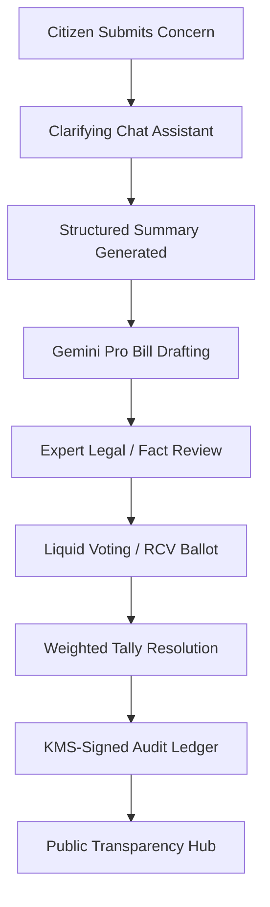

<div align="center">
  

  # Common Sense Republic (CSR)

  ### *Decentralized, Direct Digital Democracy powered by Locally-Run & Verifiable AI.*

  [](LICENSE)
  [](CONTRIBUTING.md)
  [](https://buymeacoffee.com/rorrimaesu)
  [](https://wevote-5400a.firebaseapp.com)
</div>

---

## 🏛️ The Vision

**Common Sense Republic** is an open-source prototype designed to replace career politicians with a transparent, advisory, citizen-led digital democracy. 

Instead of delegating decisions to representatives who are susceptible to lobbying and partisan gridlock, CSR puts policy drafting and voting directly into the hands of the community. We leverage state-of-the-art Large Language Models (LLMs) not as decision-makers, but as **impartial facilitators and legislative drafters**, ensuring that citizen concerns are translated into clear, structured, and legally cohesive policy proposals.

Every step of the process—from the initial conversation with the drafting assistant to the final ballot tally—is cryptographically signed, immutable, and fully verifiable by any citizen.

---

## 🔄 The Policy Pipeline

Here is how a citizen concern becomes a fully audited policy recommendation:



---

## 🛡️ Core Guarantees & Features

* **Voter Privacy & Security:** Votes are fully decoupled from plain user identifiers. All vote records are stored under a private SHA256 `voterHash` derived from `voterUid + ballotId`, keeping choices anonymous.
* **Liquid Democracy with Traversal:** Support for transitive delegations on a per-topic basis. If you trust an expert on transportation, you can delegate your vote to them. Direct votes always override delegations, and cycles are automatically detected and pruned.
* **Cryptographic Receipts:** Cast ballots receive a secure `HMAC-SHA256` receipt code (`CSR-RECEIPT-<hash>`) allowing voters to verify their vote exists in the final tally without exposing their choice to coercion.
* **Append-Only Transparency Ledger:** Tally results are recorded in a cryptographically linked hash-chain (`transparency_ledger`) verified client-side to guarantee audit logs haven't been tampered with.
* **Hardened Assistant Workflows:** Prompt versioning, input validation, strict schemas, rolling summary context compression, and rate limits shield our LLM pipelines from injection attacks and API abuse.

---

## 📁 Monorepo Structure

* [`web/`](file:///d:/aiPolitician/web) – Next.js 14 (App Router) frontend styled with Tailwind CSS.
* [`functions/`](file:///d:/aiPolitician/functions) – Firebase Cloud Functions (TypeScript) hosting our secure tally and LLM APIs.
* [`packages/shared/`](file:///d:/aiPolitician/packages/shared) – Pure TypeScript modules, including the deterministic Ranked-Choice Voting (RCV) tally algorithm.

---

## 🚀 Getting Started

### Prerequisites
* Node.js 18+ (Node 20 recommended)
* Firebase CLI
* Gemini API Key

### Local Installation

1. **Clone the repository and install dependencies:**
   ```bash
   # Install shared package dependencies & build
   cd packages/shared
   npm install
   npm run build

   # Install Cloud Functions dependencies
   cd ../../functions
   npm install

   # Install Web App dependencies
   cd ../web
   npm install
   ```

2. **Configure local environment variables:**
   Create a `.env` file in the `functions/` directory:
   ```env
   GEMINI_API_KEY=your_api_key_here
   RECEIPTS_SECRET=local-dev-secret
   ```

3. **Start the Firebase Emulators:**
   ```bash
   cd functions
   npm run serve
   ```

4. **Run the Next.js development server:**
   ```bash
   cd ../web
   npm run dev
   ```
   Open [http://localhost:3000](http://localhost:3000) to view the application.

---

## 🤝 How to Contribute

We are building a movement to change how society governs itself. We welcome contributors of all backgrounds:

### 💻 For Developers
* Check out the [Roadmap](#-roadmap-high-priority-tasks) below and pick up open tasks.
* Optimize our client-side ledger verification page or help integrate streaming LLM responses.
* Help port our models to run locally (e.g., using Ollama or Gemma 2) to eliminate external API dependencies entirely.

### ⚖️ For Policy & Legal Experts
* Help refine the **Expert Review Pipeline** prompt templates.
* Assist in drafting the guidelines for the Community Governance Board.

### 📢 For Community Organizers
* Help set up local town-hall pilots using Common Sense Republic to run mock local referendums.

Please read our [Contributing Guide](file:///d:/aiPolitician/CONTRIBUTING.md) to get started.

---

## 🗺️ Roadmap & High-Priority Tasks

- [x] Voter privacy protection via hashed document IDs
- [x] Weighted Liquid Democracy delegation traversal in tally engine
- [x] Transparent RCV tie-breakers using options creation order
- [x] Dynamic Firestore moderation vocabulary loading
- [ ] RAG ingestion pipeline + Pro drafting flow (citations, provenance expansion)
- [ ] CI/CD GitHub Actions pipeline (lint, test, deploy staging)
- [ ] Port assistant to run fully local open-weights models (Gemma)
- [ ] Streaming assistant responses (progressive render)
- [ ] Advanced editor suggestion mode & version diff viewer

---

## 🛠️ Developer Reference & Technical Specifications

<details>
<summary><b>Click to expand Technical Reference (Configuration, Rules, Tallying, Troubleshooting)</b></summary>

### Implemented Feature Matrix

| Domain | Status | Notes |
|--------|--------|-------|
| Draft Generation | ✅ | Caching via `(concernId + promptHash)` |
| Voting (simple, approval, RCV) | ✅ | Deterministic options-order tie-break |
| Vote Receipts | ✅ | HMAC-SHA256 truncated to 32 hex + short code |
| Transparency Ledger | ✅ | Append-only hash chain (`transparency_ledger`) |
| Prompt Library Export | ✅ | Versioning & template hashing |
| Receipt Verification | ✅ | Non-identifying vote proof |
| Rate Limits | ✅ | Drafts (10/hr), Ballots (3/6h), Votes (10/hr) |

### Gemini API Key & Model Configuration
The draft generation functions look up the Gemini key in this order:
1. `functions.config().gemini.key` (Firebase Functions runtime config – production)
2. `process.env.GEMINI_API_KEY` (environment variable – local/emulator fallback)

#### Set Key in Firebase (Production)
```bash
firebase functions:config:set gemini.key="YOUR_GEMINI_API_KEY"
firebase deploy --only functions
```

#### Model Variant Tier Mapping
* **Basic:** `gemini-2.5-flash-lite`
* **Verified:** `gemini-2.5-flash`
* **Expert/Admin:** `gemini-2.5-pro`

### Troubleshooting & Logs

| Symptom | Likely Cause | Resolution |
|---------|--------------|-----------|
| Frontend not showing new functions | Hosting not redeployed | Run full deploy including Hosting |
| Missing signatures in ledger | KMS key not configured | Configure `kms.keypath` or ignore (optional) |
| Repeated draft creation for same prompt | Caching bypassed due to prompt change | Confirm stable prompt template & hashing |

To view detailed server errors, check the Firebase Console -> Functions -> Logs.
</details>

---

<div align="center">
  <sub>Built with ❤️ by the Common Sense Republic Community. Let's make democracy transparent.</sub>
</div>
