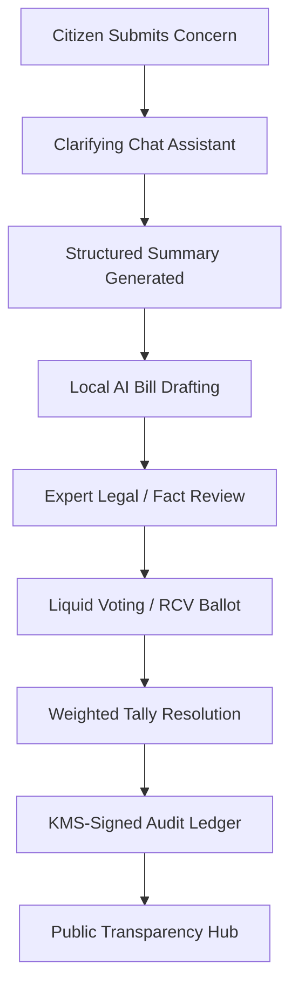

<div align="center">
  

  # Common Sense Republic (CSR)

  ### *Decentralized, Direct Digital Democracy powered by Locally-Run & Verifiable AI.*

  [](LICENSE)
  [](CONTRIBUTING.md)
  [](https://buymeacoffee.com/rorrimaesu)
  [](https://wevote-5400a.firebaseapp.com)
</div>

---

## 🏛️ The Vision

**Common Sense Republic** is an open-source prototype designed to replace career politicians with a transparent, advisory, citizen-led digital democracy. 

Instead of delegating decisions to representatives who are susceptible to lobbying and partisan gridlock, CSR puts policy drafting and voting directly into the hands of the community. We leverage state-of-the-art Large Language Models (LLMs) not as decision-makers, but as **impartial facilitators and legislative drafters**, ensuring that citizen concerns are translated into clear, structured, and legally cohesive policy proposals.

Every step of the process—from the initial conversation with the drafting assistant to the final ballot tally—is cryptographically signed, immutable, and fully verifiable by any citizen.

---

## 🔄 The Policy Pipeline

Here is how a citizen concern becomes a fully audited policy recommendation:



---

## 🛡️ Core Guarantees & Features

* **Voter Privacy & Security:** Votes are fully decoupled from plain user identifiers. All vote records are stored under a private SHA256 `voterHash` derived from `voterUid + ballotId`, keeping choices anonymous.
* **Liquid Democracy with Traversal:** Support for transitive delegations on a per-topic basis. If you trust an expert on transportation, you can delegate your vote to them. Direct votes always override delegations, and cycles are automatically detected and pruned.
* **Cryptographic Receipts:** Cast ballots receive a secure `HMAC-SHA256` receipt code (`CSR-RECEIPT-<hash>`) allowing voters to verify their vote exists in the final tally without exposing their choice to coercion.
* **Append-Only Transparency Ledger:** Tally results are recorded in a cryptographically linked hash-chain (`transparency_ledger`) verified client-side to guarantee audit logs haven't been tampered with.
* **Hardened Assistant Workflows:** Prompt versioning, input validation, strict schemas, rolling summary context compression, and rate limits shield our LLM pipelines from injection attacks and API abuse.

---

## 🤖 Local-First AI Architecture

Common Sense Republic runs entirely on local, client-side inference to protect citizen privacy, eliminate central hosting/inference costs, and ensure censorship resistance. The application supports two primary routing modes:

### 1. WebGPU In-Browser Inference (LiteRT-LM)
Run models directly in the user's browser using the WebGPU standard. Models are downloaded once and cached securely in the browser's Origin Private File System (OPFS):
* **SmolLM2 Ultra-Light (135M):** Under 250MB, runs on budget mobile/desktop environments (requires ~4GB RAM).
* **Gemma 4 Efficient (2.5B):** Optimally balanced for standard consumer devices.
* **Gemma 4 Pro (4.5B):** Advanced reasoning and drafting capabilities (requires ~8GB+ RAM).

### 2. Local Ollama Integration
Connects directly to an Ollama daemon running on the user's local machine (`http://localhost:11434`):
* **Recommended Model:** `gemma4:e4b` (4.5B parameter instruction model).
* Offers speculative multi-token prediction (`draft_num_predict`) for fast, local response streams.

---

## 📁 Monorepo Structure

* [`web/`](file:///d:/aiPolitician/web) – Next.js 14 (App Router) frontend styled with Tailwind CSS, hosting the local inference controllers.
* [`functions/`](file:///d:/aiPolitician/functions) – Firebase Cloud Functions (TypeScript) hosting our secure tally and auditing APIs.
* [`packages/shared/`](file:///d:/aiPolitician/packages/shared) – Pure TypeScript modules, including the deterministic Ranked-Choice Voting (RCV) tally algorithm.

---

## 🚀 Getting Started

### Prerequisites
* Node.js 18+ (Node 20 recommended)
* Firebase CLI
* (Optional) [Ollama](https://ollama.com) installed for desktop background inference.

### Local Installation

1. **Clone the repository and install dependencies:**
   ```bash
   # Install shared package dependencies & build
   cd packages/shared
   npm install
   npm run build

   # Install Cloud Functions dependencies
   cd ../../functions
   npm install

   # Install Web App dependencies
   cd ../web
   npm install
   ```

2. **Configure local environment variables:**
   Create a `.env` file in the `functions/` directory for local developer testing:
   ```env
   RECEIPTS_SECRET=local-dev-secret
   ```

3. **Pull the Ollama model (if using Ollama mode):**
   ```bash
   ollama pull gemma4:e4b
   ```

4. **Start the Firebase Emulators:**
   ```bash
   cd functions
   npm run serve
   ```

5. **Run the Next.js development server:**
   ```bash
   cd ../web
   npm run dev
   ```
   Open [http://localhost:3000](http://localhost:3000) to view the application.

---

## ☕ Support the Project

If you believe in direct digital democracy and want to help support our hosting costs, consider buying us a coffee!

<a href="https://buymeacoffee.com/rorrimaesu" target="_blank"></a>

---

## 🤝 How to Contribute

We are building a movement to change how society governs itself. We welcome contributors of all backgrounds:

### 💻 For Developers
* Check out the [Roadmap](#-roadmap-high-priority-tasks) below and pick up open tasks.
* Optimize our client-side WebGPU loading states or help implement fine-tuned local models.
* Standardize local system prompts and help port the ledger check UI to Next.js App Router templates.

### ⚖️ For Policy & Legal Experts
* Help refine the local prompt schemas used for synthesis and drafting.
* Assist in drafting the guidelines for the Community Governance Board.

### 📢 For Community Organizers
* Help set up local town-hall pilots using Common Sense Republic to run mock local referendums.

Please read our [Contributing Guide](file:///d:/aiPolitician/CONTRIBUTING.md) to get started.

---

## 🗺️ Roadmap & High-Priority Tasks

- [x] Voter privacy protection via hashed document IDs
- [x] Weighted Liquid Democracy delegation traversal in tally engine
- [x] Transparent RCV tie-breakers using options creation order
- [x] Dynamic Firestore moderation vocabulary loading
- [x] Local-first WebGPU (LiteRT-LM) and Ollama integration
- [ ] Ingestion pipelines for municipal code (citations and local law RAG integration)
- [ ] CI/CD GitHub Actions pipeline (lint, test, deploy staging)
- [ ] Streaming assistant responses (progressive render)
- [ ] Advanced editor suggestion mode & version diff viewer

---

## 🛠️ Developer Reference & Technical Specifications

<details>
<summary><b>Click to expand Technical Reference (Configuration, Rules, Tallying, Troubleshooting)</b></summary>

### Implemented Feature Matrix

| Domain | Status | Notes |
|--------|--------|-------|
| Draft Generation | ✅ | Client-controlled local model routing |
| Voting (simple, approval, RCV) | ✅ | Deterministic options-order tie-break |
| Vote Receipts | ✅ | HMAC-SHA256 truncated to 32 hex + short code |
| Transparency Ledger | ✅ | Append-only hash chain (`transparency_ledger`) |
| Prompt Library Export | ✅ | Versioning & template hashing |
| Receipt Verification | ✅ | Non-identifying vote proof |
| Rate Limits | ✅ | Drafts (10/hr), Ballots (3/6h), Votes (10/hr) |

### Troubleshooting & Logs

| Symptom | Likely Cause | Resolution |
|---------|--------------|-----------|
| Frontend not showing new functions | Hosting not redeployed | Run full deploy including Hosting |
| Missing signatures in ledger | KMS key not configured | Configure `kms.keypath` or ignore (optional) |
| WebGPU fails to load | Browser WebGPU not enabled / incompatible hardware | Open local settings in header and select Ollama mode |

To view detailed server errors, check the Firebase Console -> Functions -> Logs.
</details>

---

<div align="center">
  <sub>Built with ❤️ by the Common Sense Republic Community. Let's make democracy transparent.</sub>
</div>
